# User Flow Map: Zoid Code Workspace

Date: 2026-06-06
Module: Code Workspace
Source grill: `/Users/ziadnasreldin/brainstorms/2026-06-06-zoid-code-workspace-user-flow-map.md`
Source PRD: `/Users/ziadnasreldin/Zoid/Docs/modules/code-workspace/prd.md`
Stitch project: https://stitch.withgoogle.com/projects/1952838208663206055

## 1. Flow principles

- Code Workspace is the repo/status/shipping hub.
- Normal repo click is lightweight: select repo, update inspector, stay in command center.
- Full repo detail opens through double-click, Open Details, or a focused resolution route.
- What Needs Me behaves like an inbox: every item opens the exact flow needed to resolve it.
- Launch Gate is the central shipping hub.
- Every missing Launch Gate item routes to its own resolution flow.
- Evidence flows always return to Launch Gate when launched from shipping.
- Start Agent keeps the user in Code Workspace by default, with optional Open in Agents Workspace / Split Panel.
- Every modal/subflow preserves origin context for cancel/back.
- No flow marks launch/deploy verified without required evidence.

## 2. Primary screen nodes

- Code Workspace / Repo Health Command Center
- Empty Code Workspace
- Repo Discovery / Scan Folders
- Managed Repositories List
- Right Inspector
- Repository Detail
- Run Checks
- Start Agent From Repo Modal
- Agents Workspace linked session
- Launch Gate
- Evidence Attachment / Verification
- Commit / PR Workflow
- GitHub / PR Integration
- Deployment Tracking / Actions
- Repo Settings / Fix Path
- Search / History / Archive
- Repo Handoff Export
- Native Verification / Diagnostics
- macOS Finder / Editor / Terminal external exits

## 3. First-time entry flow

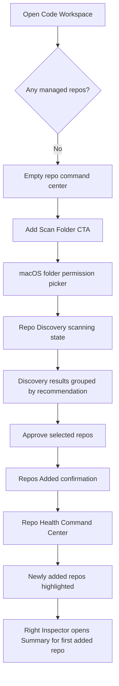

## 4. Returning entry flow

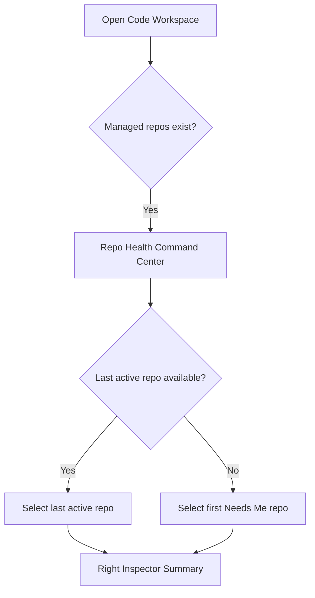

## 5. Repo selection and navigation flow

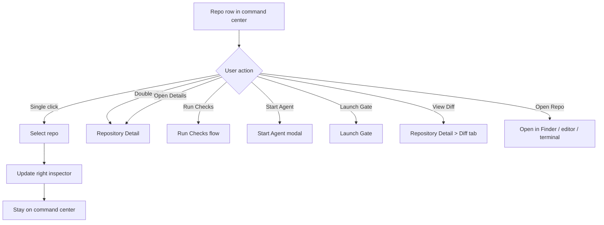

## 6. Repo discovery approval flow

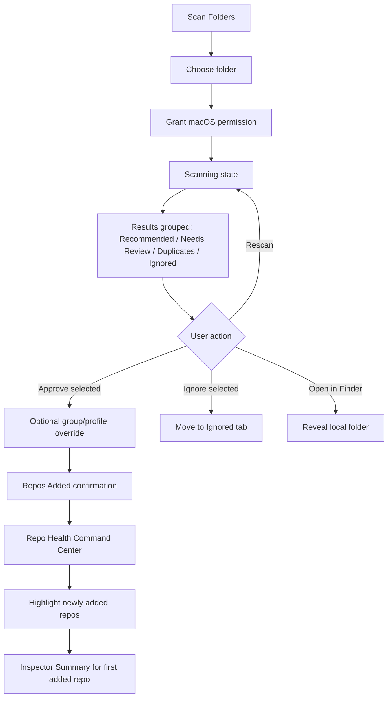

## 7. What Needs Me / attention inbox flow

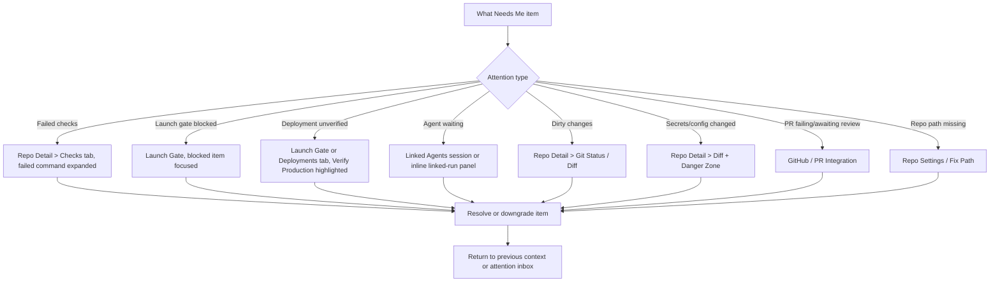

## 8. Run Checks flow

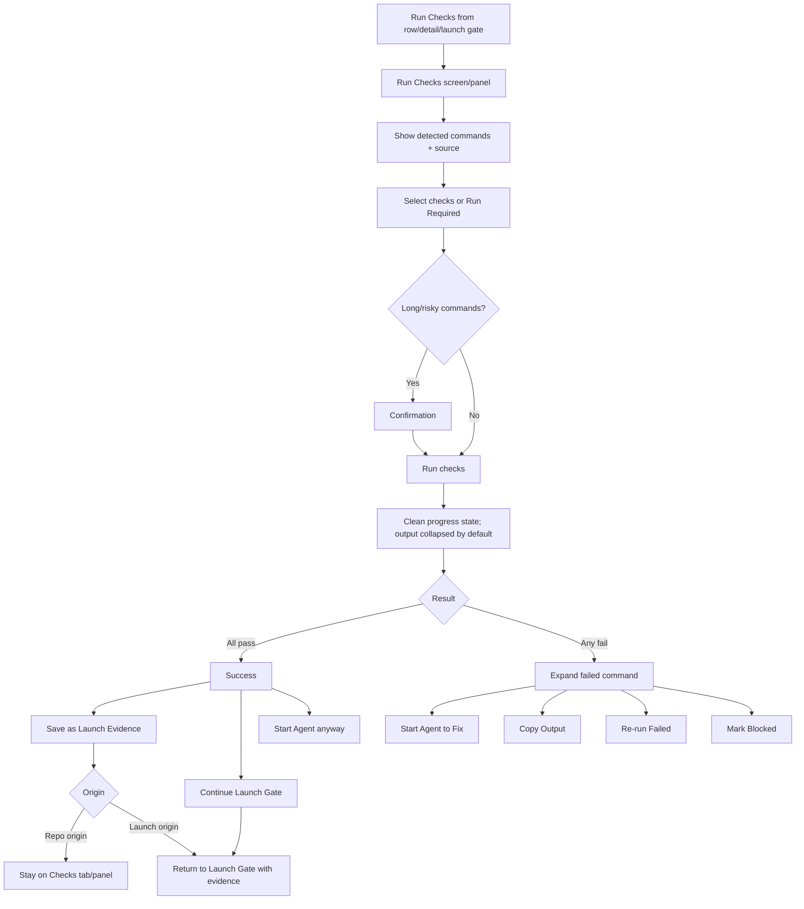

## 9. Start Agent from repo flow

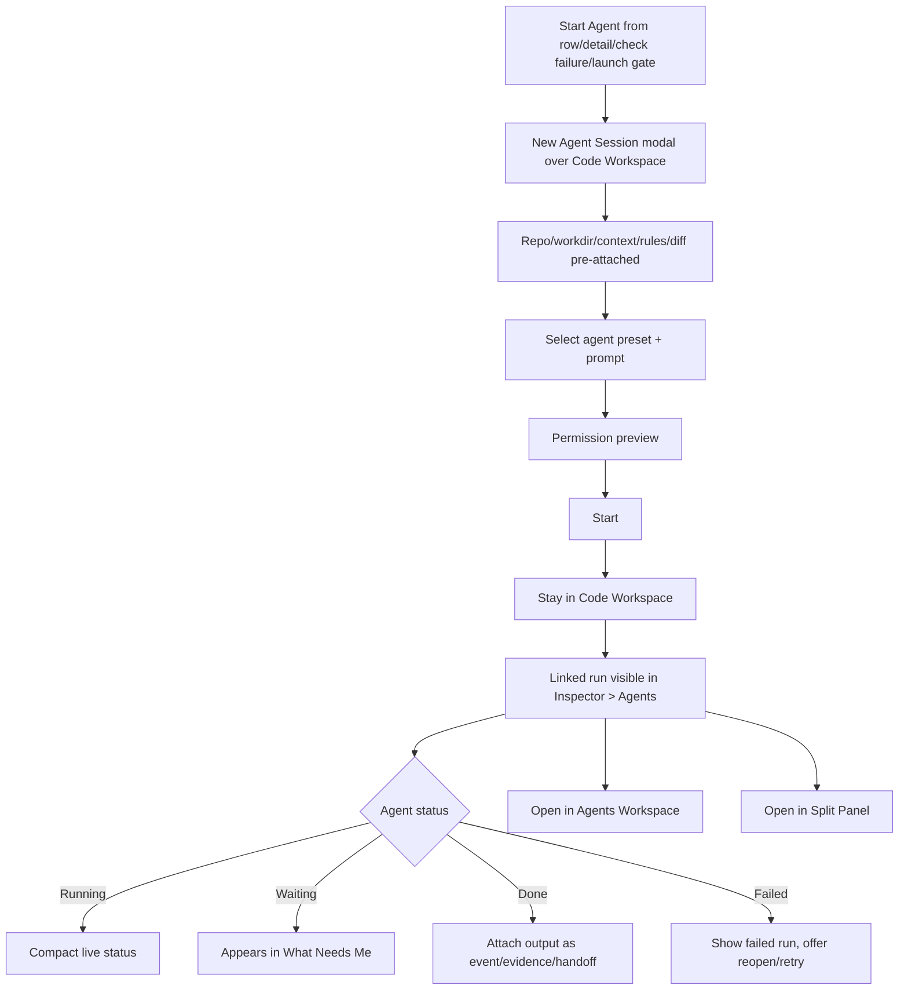

## 10. Launch Gate flow

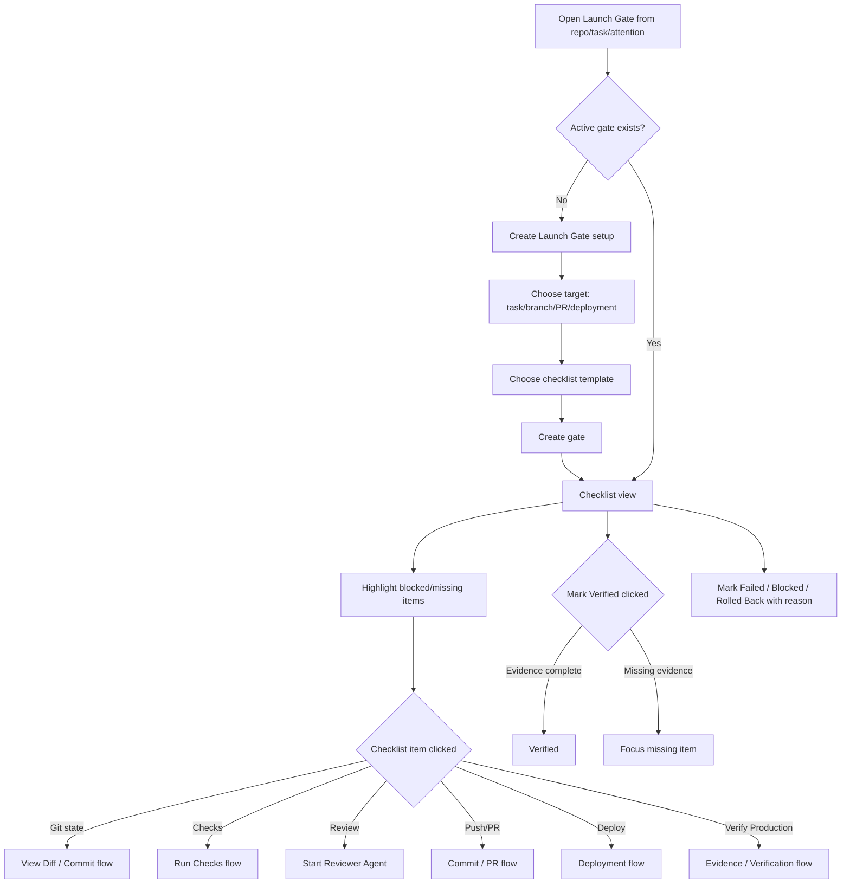

## 11. Evidence / verification flow

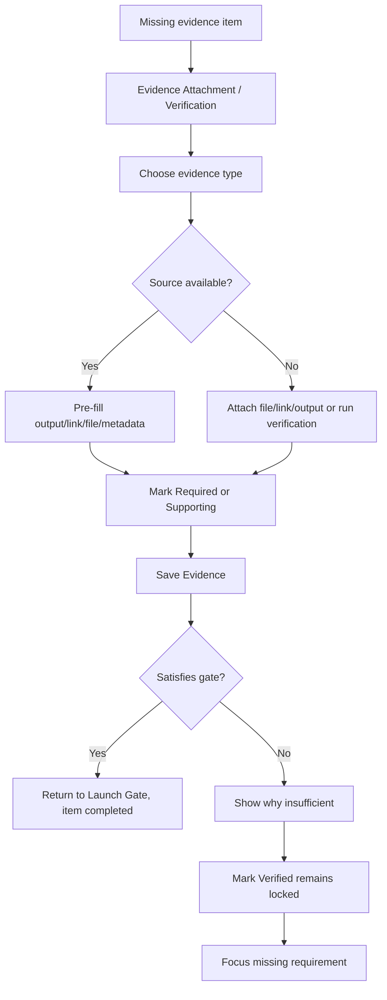

## 12. Commit / PR flow

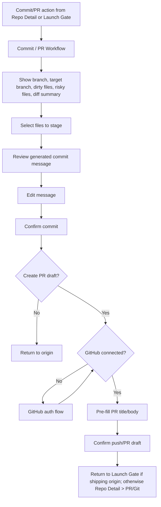

## 13. Deployment flow

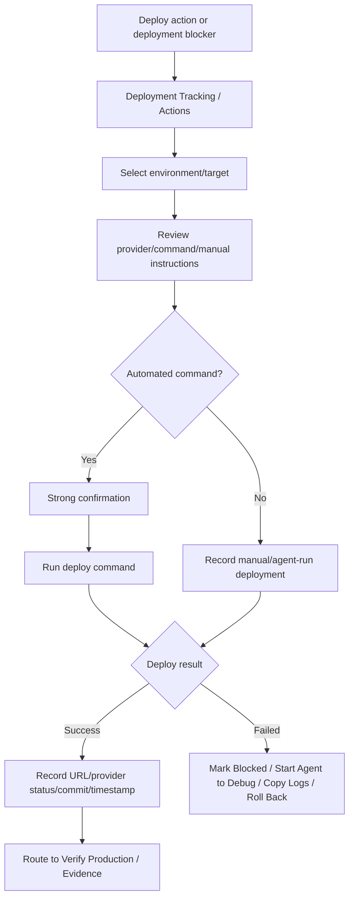

## 14. GitHub auth / remote flow

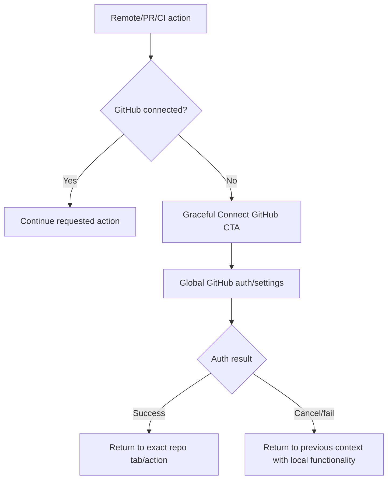

## 15. Repo Settings / Fix Path flow

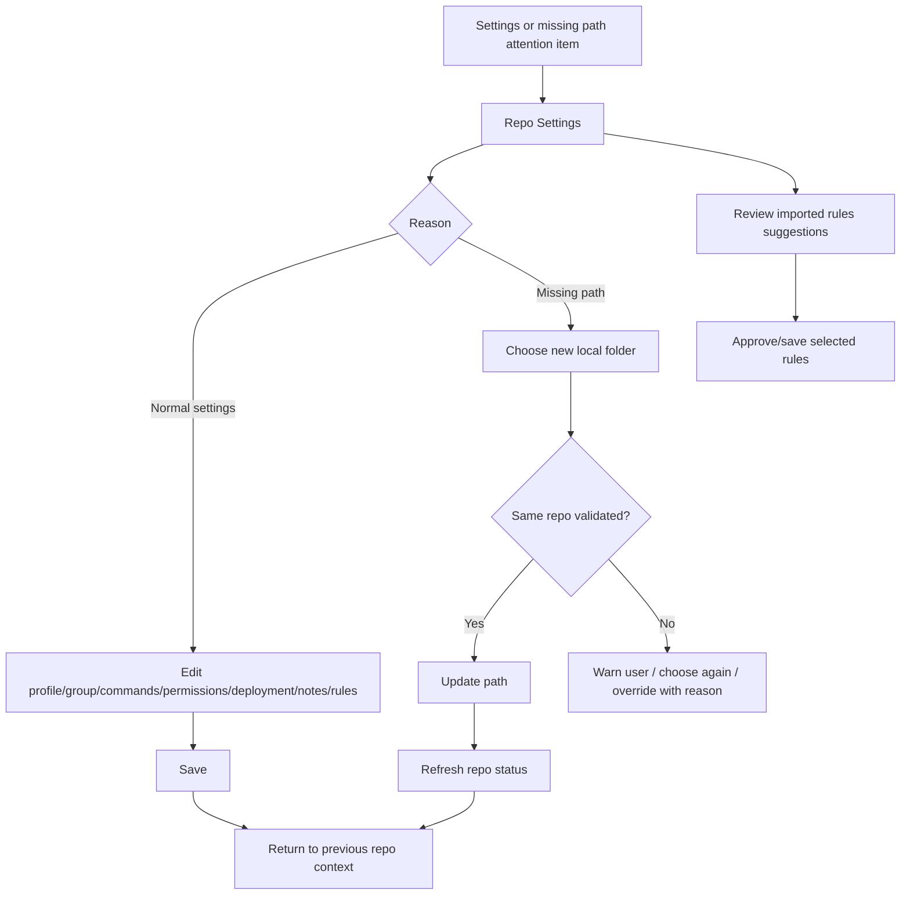

## 16. Search / History / Archive flow

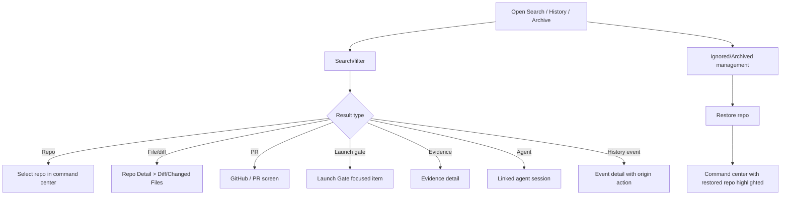

## 17. Handoff export flow

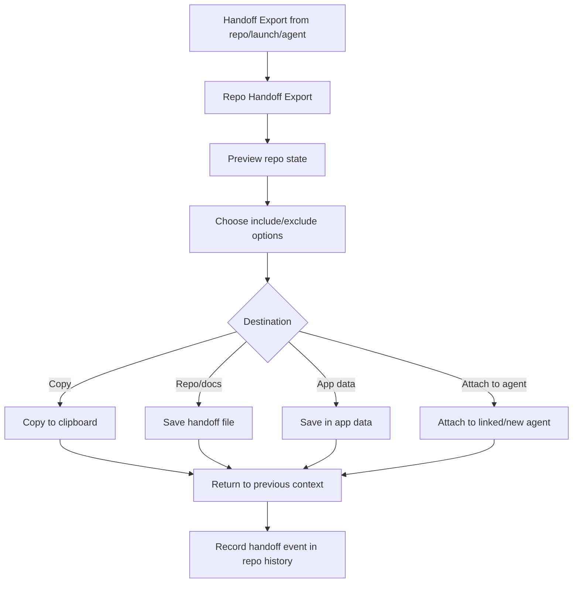

## 18. Native verification / diagnostics flow

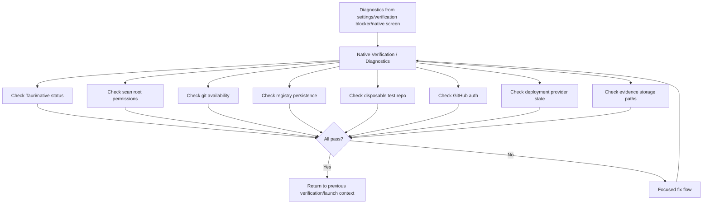

## 19. Cancel, back, and failure behavior

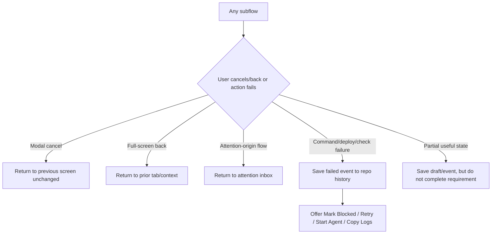

## 20. Cross-workspace Agents handoff

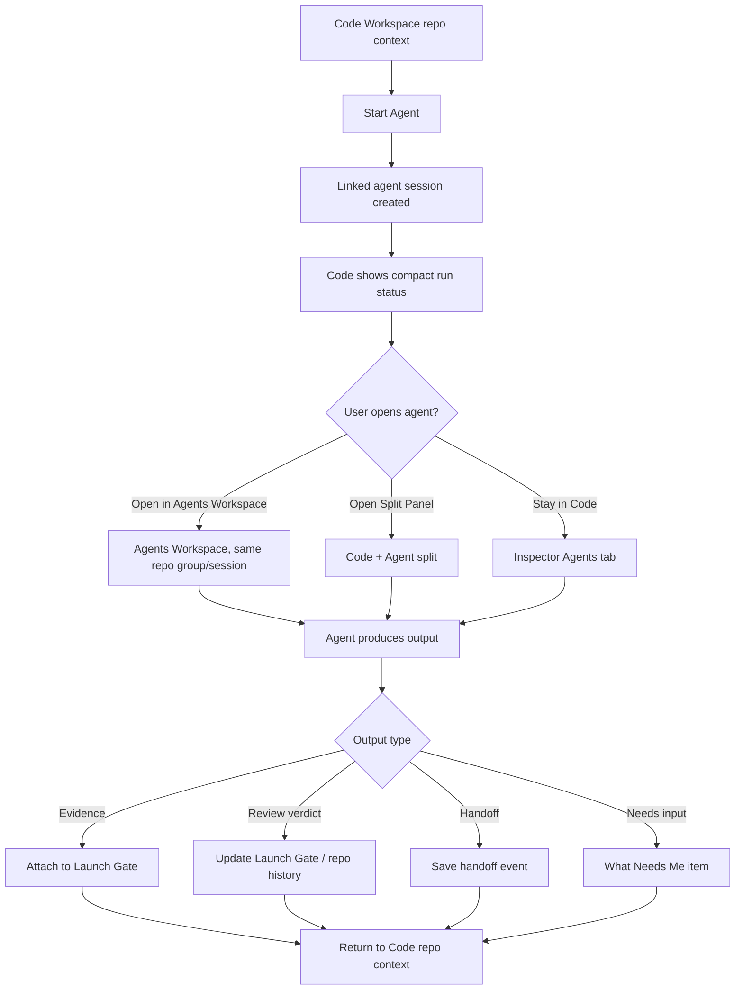

## 21. End-to-end happy paths

### 21.1 First repo onboarding

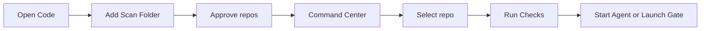

### 21.2 Fix failed checks with agent

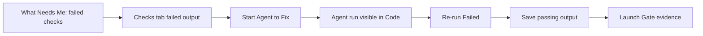

### 21.3 Ship with evidence

```mermaid
flowchart LR
  A[Launch Gate] --> B[Resolve Git state] --> C[Run Checks] --> D[Review Agent] --> E[Commit/PR] --> F[Deploy] --> G[Verify Production] --> H[Attach Evidence] --> I[Mark Verified]
```

### 21.4 Repair missing repo path

```mermaid
flowchart LR
  A[What Needs Me: path missing] --> B[Fix Path] --> C[Choose folder] --> D[Validate repo] --> E[Refresh status] --> F[Return to Command Center]
```

## 22. Flow implementation checklist

- Preserve origin context for every modal and full-screen flow.
- Store originating route/action for Run Checks, Evidence, Commit/PR, Deployment, GitHub Auth, Settings, Diagnostics, and Agent flows.
- Ensure every attention item has a deterministic target route and focus target.
- Ensure every Launch Gate checklist item has a deterministic resolution route.
- Ensure all successful subflows update repo history.
- Ensure failed commands/deployments/verifications can become Blocked/Failed evidence but never success evidence.
- Ensure external exits to Finder/editor/terminal return focus/state cleanly when user comes back to Zoid.
- Ensure restart restores selected repo, last active route, managed registry, launch gates, evidence, linked agents, and history.
